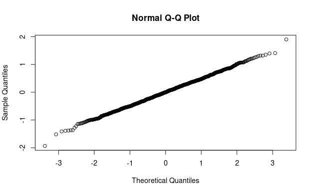

```{r setup, include=FALSE}
knitr::opts_chunk$set(echo = TRUE)
knitr::include_graphics("~/Desktop/githubbahubba/CSUF/spring 2024/MATH 536/Exam1")
setwd("~/Desktop/githubbahubba/CSUF/spring 2024/MATH 536/Exam1")
```

### Executive Summary

I have analyzed DARPA artillery data to determine the average error in projectile targeting at specific distances (0.1 km, 1 km, and 10 km). Because traditional analysis methods were unsuitable due to the data's lack of a clear, predictable model it was necessary to employ a robust statistical method that resamples existing data to generate a more comprehensive picture. This approach lead to more accurate estimations.The analysis suggests the following for the average errors:
1 km: Average error = -0.1926 meters 
0.1 km: Average error = -0.0646 meters
10 km: The provided data lacked observations at this distance. To address this gap, we estimated the average error at 8 km (highest recorded distance) – 7.746 meters. This suggests a trend of increasing error with greater distance, implying a potential rise in error beyond 8 km. For 10 km, an accurate estimation requires additional data. To estimate the average error at 10 km with greater confidence, I recommend acquiring more data points encompassing this distance range.

It may also be important to note the confidence intervals that each of these average errors fall into. Confidence intervals consist of two numbers in which we are 95% certain that our prediction falls between.

The intervals are as follows:
(-0.3840533942,0.0006632323) for the 1 km distance prediction
(-0.14607491,0.01614524) for the 0.1 km distance prediction
(7.101040,8.301759) for the 8 km distance prediction


This chunk observes a interesting pattern for data that made it hard to follow the traditional analysis method. Thus I had to take another approach.





The above graphics show us that the residual (the difference between actual observed errors and and predicted errors) are distributed in a way that would be centered at zero and are also closely follow a normal distribution. Thus they would be necessary to collect before we moved onto the robust resampling method.


### Code for Analysis

```{r}
# import data
data <- read.csv("exam1.csv",head = T)
attach(data)
Distance..km. -> x
Error..m. -> y
plot(Distance..km.,Error..m.)
```

```{r}
#Cross validation, leave one out.
n = length(x)
CV = function(h){
	SSR = 0
	for(i in 1:n){
		y1 = sum(exp(-.5*((x[i]-x[-i])/h)^2)*y[-i])/sum(exp(-.5*((x[i]-x[-i])/h)^2))
		resid = y[i] - y1
		SSR = SSR + resid^2
	}
	SSR
}
#CV(h)
h=optim(1,CV)$par
# do kernel regression to get original residuals
x1 = x
y1 = rep(0,1400)
for(i in 1:1400){
	y1[i] = sum(exp(-.5*((x1[i]-x)/h)^2)*y)/sum(exp(-.5*((x1[i]-x)/h)^2))
}
resid = y - y1

# check residuals for normality and centered at zero
hist(resid,breaks = 50)
plot(x, resid)
qqnorm(resid)
```

```{r}
# begin bootstrapping
# set initials
Y <- matrix(0,ncol = 3, nrow = 10001)
set.seed(315429687)
#begin loop
for (it in 1:10001){
# bootstrap x values
BS.x <- sample(x,n,replace = T)
n.BS <- length(BS.x)

# compute the BS.yhat to find BS.y
BSyhat = rep(0,n.BS)
for (i in 1:n.BS){
  BSyhat[i] <- sum(exp(-.5 * ((BS.x[i] - x) / h)^2) * y) / sum(exp(-.5 * ((BS.x[i] - x) / h)^2))
}
BS.y <- BSyhat + sample(resid,n,replace=T)

# Plug x1 = 10 into the new model and store result
# we cannot plug in x = 10 as it is out of range but we can get the max(x)
x1 = max(x)
Y[it,1] = sum(exp(-.5 * ((x1 - BS.x) / h)^2) * BS.y) / sum(exp(-.5 * ((x1 - BS.x) / h)^2))
 
# Plug x1 = 1 into the new model and store result
x1 = 1
Y[it,2] = sum(exp(-.5 * ((x1 - BS.x) / h)^2) * BS.y) / sum(exp(-.5 * ((x1 - BS.x) / h)^2))

# Plug x1 = 1 into the new model and store result
x1 = 0.1
Y[it,3] = sum(exp(-.5 * ((x1 - BS.x) / h)^2) * BS.y) / sum(exp(-.5 * ((x1 - BS.x) / h)^2))
}
# name columns in Y
# names(Y) = c("x=max(x)","x=1","x=0.1")

# histograms of new data
hist(Y[,1],breaks = 40)
hist(Y[,2],breaks = 40)
hist(Y[,3],breaks = 40)
```


```{r}
# form the cutoffs 
#cutoff function
cut <- function(v,i){
 if(i == "up"){
 return(quantile(v,.975))
 } else {
 return(quantile(v,.025))
 }
}

# conf.interval for x=max(x)
CImax = c(cut(Y[,1],"lo"),cut(Y[,1],"up"))
CImax
# conf.interval for x=1
CI_1 = c(cut(Y[,2],"lo"),cut(Y[,2],"up"))
CI_1
# conf.interval for x=0.1
CI_0.1 = c(cut(Y[,3],"lo"),cut(Y[,3],"up"))
CI_0.1

```

```{r}
# finding the means of each y1
for(i in 1:3){print(mean(Y[,i]))}
```


