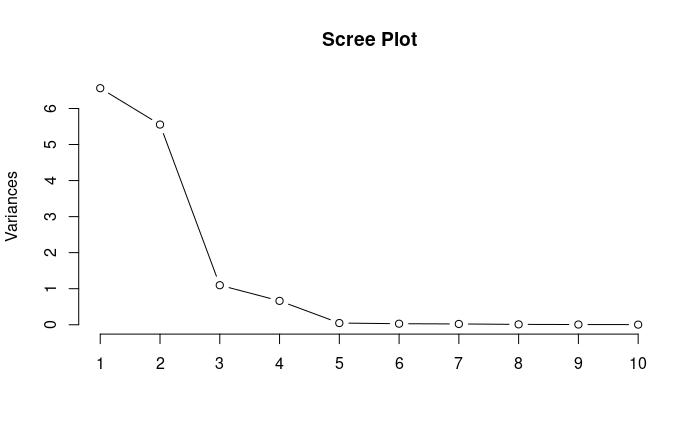

```{r setup, include=FALSE}
knitr::opts_chunk$set(echo = TRUE)
data1 <- read.csv("math120examscores.csv", h= T)
data2 <- read.csv("drivPoints.txt",h = T)
library(plyr)
library(scales)
library(grid)
library(ggplot2)
```


# Analyis: Problem 1

We aimed to find marginal confidence intervals for scores from a math class of 62 students, covering midterm 1, midterm 2, and the final exam. Our dataset contained missing information (NAs), so we used the Expectation-Maximization (EM) algorithm to handle this issue. The EM algorithm helped us estimate missing values and update parameter estimates iteratively. While this allowed us to proceed with our analysis, the resulting estimates and confidence intervals are not perfect due to the missing data. We computed the marginal confidence intervals for midterm 1, midterm 2, and the final exam scores. The table below summarizes our findings:

\begin{table}[ht]
\centering
\begin{tabular}{lcc}
    var & lower & upper \\
    \hline
    exam1 & 73.06095 & 77.64294 \\
    exam2 & 77.38377 & 80.00883 \\
    final & 76.88651 & 79.40906 \\
    \hline
\end{tabular}
\end{table}

These confidence intervals are based on imputed data and should be seen as suggestive. The missing data introduces uncertainty, highlighting the importance of appropriate handling and cautious interpretation.

# Analyis: Problem 2

In this analysis, I am working with graphical image data collected over several days from people driving. The data captures various aspects of facial positioning, including eye position, nose position, mouth movements, general head position, and gaze direction. Our objective is to build a predictive model that determines the direction a person’s face is looking based on these variables. I will refer to this prediction as "gaze direction."

### Variable Reduction with PCA

Given the dataset comprises 14 different variables, it was crucial to reduce the number of variables to simplify the model and improve interpretability. We employed Principal Component Analysis (PCA) for this purpose. PCA is a dimensionality reduction technique that transforms the original variables into a smaller set of uncorrelated components. 



The scree plot reveals that the first few components explain the majority of the variance, suggesting that 4 components might be sufficient for our model. To confirm this, we evaluated the R-squared values for models using 4, 5, and 6 components. I found that using 6 components provided an R-squared value of 0.8096953 which was close to 0.846029 which was the R-squared value from using all 14 variables. Thus, selecting 6 components offers a balance between model simplicity and predictive accuracy, reducing the number of variables by more than half.

\begin{table}[h]
\centering
\begin{tabular}{cc}
\hline
No. of Components & R-squared Value \\
\hline
4 & 0.7561574 \\
5 & 0.7873039 \\
6 & 0.8096953 \\
14 & 0.846029 \\
\hline
\end{tabular}
\end{table}

Examining the loading coefficients of the principal components provides insights into how each original variable influences the components. The analysis showed:

Components 1 and 2: These components did not show significant influences from the variables, indicating that they might not capture substantial patterns related to gaze direction.
Component 3: This component was strongly influenced by variables related to the height and width of the face, suggesting it captures significant aspects of facial geometry.
Component 4: This component focused primarily on the height of the face, highlighting its importance in gaze direction prediction.
Component 5: This component was influenced by the X-position of the face and the X-position of the right corner of the mouth, indicating its role in capturing side-to-side facial positioning.

### Regarding Factor Analysis

Factor analysis is another dimensionality reduction technique that helps in clustering similar variables together. While it doesn’t directly provide a predictive model, it is valuable for exploratory data analysis. Factor analysis revealed that:

Variables related to the Y-position (up and down) of body parts tend to group together.
Variables related to the X-position (side to side) of body parts also cluster.
The height of the face forms its own distinct factor.
These groupings help us understand how different facial features and positions relate to each other and can guide further analysis or model refinement.

\begin{table}[ht]
\centering
\begin{tabular}{lccc}
    & Factor1 & Factor2 & Factor3 \\
    \hline
    xF & & 0.923 & 0.234 \\
    yF & 0.994 & & \\
    wF & & -0.337 & 0.173 \\
    hF & & 0.306 & 0.910  \\
    xRE & & 0.992 &  \\
    yRE & 0.996 & & \\
    xLE & & 0.977 & 0.174\\
    yLE & 0.997 & & \\
    xN & & 0.992 & \\
    yN & 0.996 & & \\
    xRM & & 0.976 & \\
    yRM & 0.997 & & \\
    xLM & -0.186 & 0.948 & 0.202 \\
    yLM & 0.998 & & \\
    \hline
\end{tabular}
\end{table}

\newpage

# Code: Problem 1

let's look at dimensions

```{r}
X <- as.matrix(data1)
dim(X)
head(X)
```

Things are missing but we have an EM Algorithm to use from a past assignment.

```{r}
# to.theta function
to.theta <- function(mu,Sig){
  theta = c(0)
  p = length(Sig[,1])
  q = p*(p+1)/2
  v = matrix(c(1,1,2,1,2,2,3,1,3,2,3,3),ncol = 2, nrow = 6, byrow = T)
  for(i in 1:p){theta[i] = mu[i]}
  for(i in 1:q){theta[p+i] = Sig[v[i,1],v[i,2]]}
  return(theta)
} 

# EM algorithm
 EMfunc <- function(y,mu,Sig,tolgrad){
  # initials
  p = length(Sig[,1])
  n = length(y[,1])
  th = to.theta(mu,Sig)
  ip = norm(th, type='2')
  it = 1
  # save iterations in here
  ITER = matrix(c(it,mu[1],mu[3],Sig[1,1],Sig[3,3],ip), nrow =1, ncol = 6, byrow = T)
    while(ip >= tolgrad){
      xbar.star = c(0,0,0)
      S.star = matrix(0,p,p)

      for(i in 1:n){

        # noting missing and observed data
        obs = which(!is.na(y[i,]))
        mis = which(is.na(y[i,]))

        # use that info to get mus, sigmas, and data
        mu_o = mu[obs]
        mu_m = mu[mis]
        Sig_oo = Sig[obs,obs]
        Sig_om = Sig[obs,mis]
        Sig_mo = Sig[mis,obs]
        Sig_mm = Sig[mis,mis]
        y_o = y[i,obs]
        y_m = y[i,mis]

        # initializing expectations for the xbar and S
        E.xi = c(0)
        E.S = matrix(0,p,p)

        # get mu tilde
        Estar.y_m = mu_m + (Sig_mo %*% solve(Sig_oo)) %*% (y_o - mu_o)
        E.xi[obs] = y_o
        E.xi[mis] = Estar.y_m
        xbar.star = xbar.star + E.xi/n
        mu.tilde = xbar.star

        # get sigma tilde
        E.S[obs,obs] = y_o %*% t(y_o)
        E.S[mis,obs] = Estar.y_m %*% t(y_o)
        E.S[obs,mis] = Estar.y_m %*% t(y_o)
        E.S[mis,mis] = Sig_mm - (Sig_mo %*% solve(Sig_oo) %*% Sig_om) + (Estar.y_m %*% t(Estar.y_m))
        S.star = S.star + E.S/n
        Sig.tilde = S.star - (xbar.star %*% t(xbar.star))
    }

    # finding the gradients
    del.mu = (-1)*n*solve(Sig.tilde) %*% (mu - mu.tilde)
    J = S.star - xbar.star%*%t(mu.tilde) - mu.tilde%*%t(xbar.star) + mu.tilde%*%t(mu.tilde)
    I = diag(3)
    del.Sig = (-n/2) * solve(Sig.tilde)%*%(I - solve(Sig.tilde)%*%J)
    del.theta = to.theta(del.mu,del.Sig)

    # get the innerproduct of del.theta
    ip <- norm(del.theta, type = '2')

    # plug back in for iteration
    mu.tilde -> mu
    Sig.tilde -> Sig
    it = it + 1

    # save into dataframe
    ITER <- rbind(ITER,c(it,mu[1],mu[3],Sig[1,1],Sig[3,3],ip))
    }
# print first three and last three rows of dataframe
u <- length(ITER[,1])
# colnames(ITER) = c("Iteration","mu1","mu2","Sigma_11","Sigma_33","gradnorm")
# print("first 3 iterations")
# print(ITER[1:3,])
# print("last 3 iterations")
# print(ITER[(u-2):u,])
# print final mu and Sigma
return(list("mu estimator" = mu, "Sigma estimator" = Sig))
 }
```

```{r}
EMfunc(X,c(0,0,0),diag(3),1e-06)
```

We can use these estimators to construct the confidence interval. Let's just save them.

```{r}
EMfunc(X,c(0,0,0),diag(3),1e-06) -> Est
S1 <- Est$`Sigma estimator`
m1 <- Est$`mu estimator`
```

Here we can present the confidence intervals. We can use fomrula from notes...

$$
\bar{x}_j \pm \sqrt{\frac{p(n-1)s_j^2}{n(n-p)}\cdot F^+_{p,n-p}(\alpha)}
$$

```{r}
confInt <- function(data,xbar,sigma,alpha = .05){
  X = data
  p = dim(X)[2]
  n = dim(X)[1]
  a = alpha
  s = sigma 
  CONF <- data.frame()
  for(j in 1:p){
    num = p*(n-1)*(s[j,j])*qf(1-a,n-1,n-1)
    den = n*(n-p)
    CONF[j,1] = names(data)[j]
    CONF[j,2] = xbar[j] - sqrt(num/den)
    CONF[j,3] = xbar[j] + sqrt(num/den)
  }

  names(CONF) = c("var","upper","lower")
 return("confidence intervals" = CONF)
}
confInt(data1,m1,S1,.05)
```


The data given to us was something had had "holes" in it. This was was necessary to obtain estimators from an EM Algorithm.

# Code: Problem 2

### (a).

```{r}
# let's do some PCA work
# we need a GAMMA and LAMBDA 
X = as.matrix(data2[,6:19])
Y = as.matrix(data2[,5])
S = cov((data2)[,6:19])
GAM = as.matrix(eigen(S)$vectors)
LAM = eigen(S)$values*(diag(14))
# generate the C columns
C = X%*%GAM

```

It makes much more sense using the pca() function

```{r}
pca <- prcomp(X,scale. = T)
plot(pca, type = 'l', main = "Scree Plot")
```


four components seems to be the ball park.


```{r}
model.all <- lm(Y ~ C)
model.4 <- lm(Y ~ C[,1:4])
model.5 <- lm(Y ~ C[,1:5])
model.6 <- lm(Y ~ C[,1:6])
summary(model.all)$r.squared
summary(model.4)$r.squared
summary(model.5)$r.squared
summary(model.6)$r.squared
```

4 was in the ball park but it would be safer to choose 6 which still eliminates more that half of the components. Let us think about the loading coefficients.


```{r}
names(pca)
pca$rotation # these are the loading coefficients
summary(model.6)
```
### (b).

```{r}
fact.model = factanal(X,factors=3,rotation="varimax")
fact.model$loadings
```

With factor analysis we are clustering together variables that are alike. This information does not really give us a model to make any inference. However, this tool may be useful in exploratory data analysis. 


